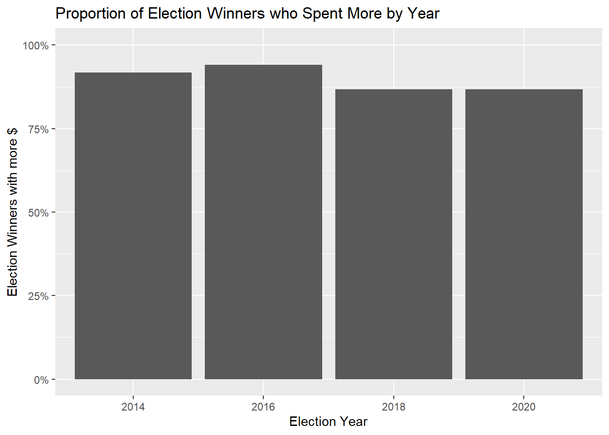
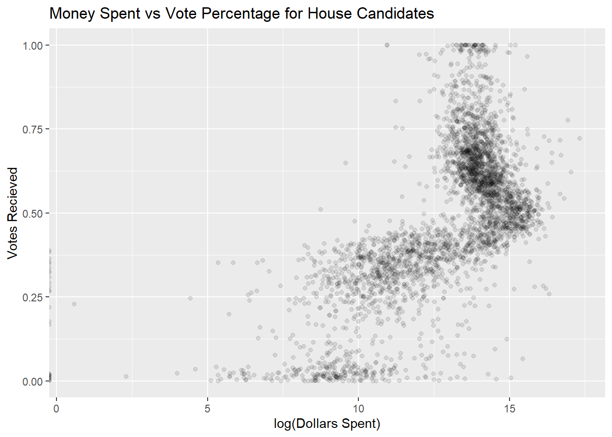
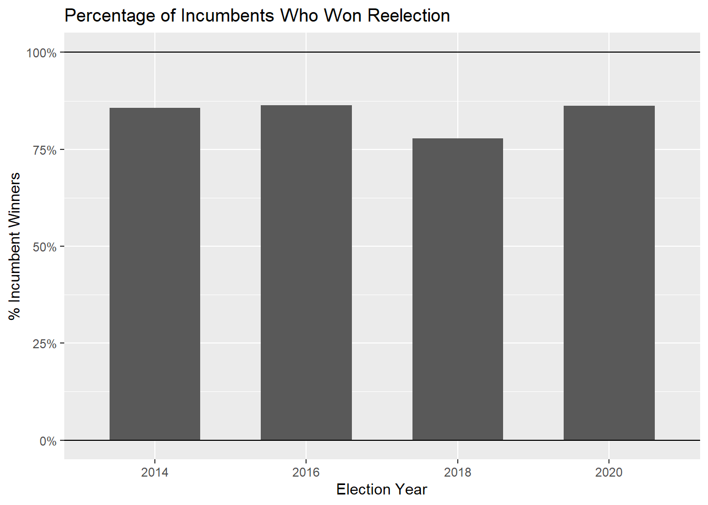
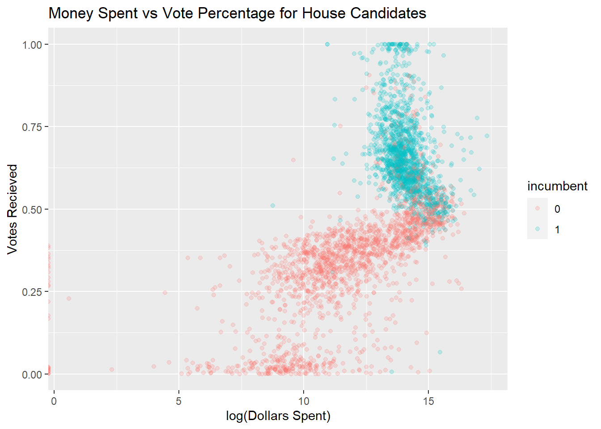
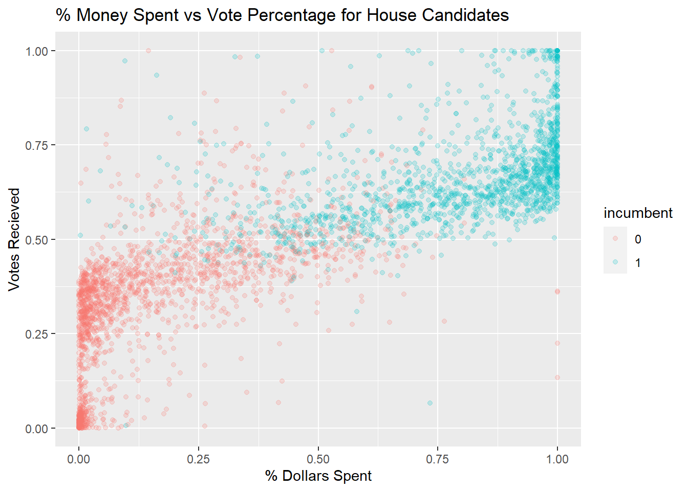
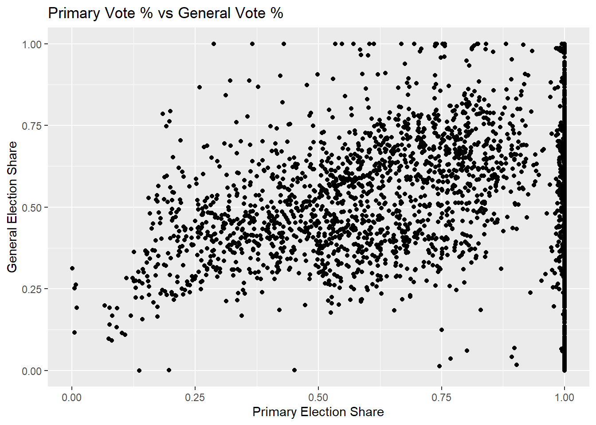
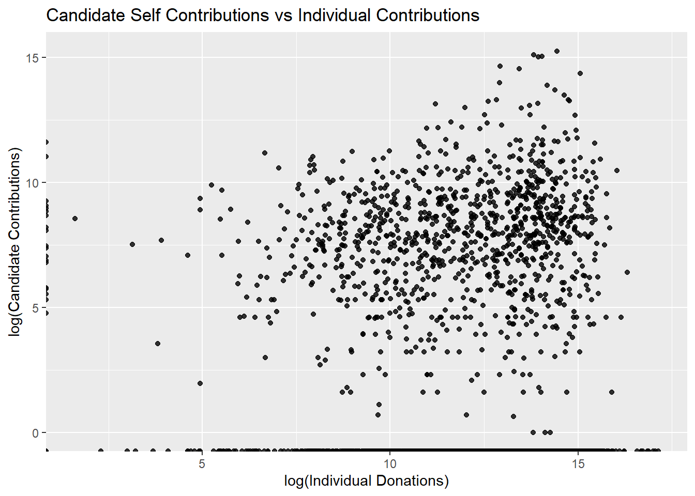

# The Effect of Increased Campaign Spending on Election Results

## Background

Much of the discourse surrounding money in politics and campaign finance in the US make it seem like money is a large determining factor in the outcomes of elections. Representatives certainly believe this to be the case (otherwise they wouldn't spend a large portion of their days making what, by all accounts, are mind-numbing calls to donors) and neither do operatives who make strategic choices about where to spend money (I myself have heard from one's mouth that they are positive they can influence elections by spending more). However, the academic consensus on this question is much more open (Levitt 1994, Ansolabehere et al. 2003).One thing is relatively clear: candidates who have money do win elections at an astonishingly high rate.

This has been a consistent finding since spending has been measured and yields an easy explanation: campaign spending plays a decisive role either in driving turnout or in influencing public opinion.

However, this "obvious" explanation conceals an equally obvious methodological problem. Candidates who raised more money and won their election might have won their election because they indeed were able to spend more or, alternatively, they might have been able to raise more because they were a better candidate and some amount of money on the margin had little to no effect (note that, while there are plenty of low visibility candidates from small parties who raised little money and got few votes, we can only really measure marginal effects of spending on votes for high quality candidates). This causal problem creates a substantial public policy issue because it becomes difficult to ascertain to what extent money actually influences election results and thus complicates debates on if policy intervention in federal elections are appropriate. 

I look at house elections from 2010 to 2022 in this analysis mostly because house election are relatively homogeneous and have substantially more elections than the Senate or Presidency. State reporting of election financing is spotty and regulations involving election financing vary wildly which makes them a less appealing focus of study compared to Federal elections. 

## Motivating Trends 

The most obvious conceptual model of campaign spending is as a simultaneous-equation-model (SEM). Elected officials don't like to fundraise and have a lot of things to do in the meantime. Challengers' decision to fundraise trades off with other activities that can support their candidacy like engagement with the community, interviews, etc. So, incumbents observe the potential threat that the challenger poses and decides to set a fundraising based on that while candidates decide on fundraising levels based on their perceived returns and projections of incumbent spending (from a game theory perspective, this is actually an iterated game, but the SEM approximation is good enough). To identify this model, we would need exogenous variation in spending for both types of candidates. However, while conceptually pleasing, there is reasonable heuristic evidence to suggest this conceptual model isn't entirely accurate. 

To illustrate this, we pivot our focus from proportions of winners to log raw money spent (total spending has a thick tail) which reveals some interesting trends:
  

There are clearly different effects of money in different parts of this graph so I'm going to break it down section by section. Firstly, most election losers spent less than average and the amount of their spending is clearly correlated with their vote share. The most money was spent by those candidates who had vote shares around 50%. These elections are the most competitive and where we'd expect the most spending to take place because an additional $50k or so has the highest chance to change the election outcome. 

For those candidates who scored substantially above 50% of the vote, there appears to be no relation between vote share and amount spent. Notably, candidates in this zone generally outraised candidates who achieved less than 50% of the vote and have a much more consistent level of funding across candidates. Most of this disparity can be explained by the advantage of incumbency. 

Another persistent fact of American elections is that incumbents win elections: they win elections a lot. In fact much of the variation in the previous graph can be explained by whether or not incumbents won reelection that year. Redoing the previous plot with points colored by incumbency shows that almost all of the points in the upper part of the graph are incumbents. 

There are many possible reasons why incumbents have such a persistent advantage in fundraising. For one, incumbents are probably higher quality candidates on average than challengers given that they have greater experience and that they have won elections before which possibly drives higher individual donations. Incumbents also have higher name recognition due to their political service which they can leverage to fundraise. The reality of incumbency advantage can also drive donations to incumbents. If a company or wealthy individual wants to influence policy or buy access to politicians but has a limited budget to do so, they are most likely to funnel their donations to the candidates which are most likely to win: which are the incumbents.

This reality means that money probably has very different effectiveness depending on how competitive a specific race is. For example, candidates which raise little money and get little of the vote are probably in a situation where more money tangibly causes more votes because it can buy them the visibility which they so desperately need: however, they are unable to drive donations to the level which would buy them widespread visibility and are probably much lower quality candidates than incumbents and would face severe diminishing returns on increased spending. In contrast, incumbents seem to spend close to the maximum observed amount regardless of whether or not they are anticipating a strong challenger in the general election. Much of this can be explained by the fact that campaign donations cannot be saved so candidates are obligated to spend all the money they get. If incumbent fundraising can be thought of as either an effort to retain connections with key donors for potentially threatening races in the future or an effort by donors to buy favor with the likely winner, it makes sense that incumbent fundraising is both high and relatively inflexible in the face of large variations in the strength of competition. 

This analysis provides a different way to interpret the more obvious way of contextualizing a candidates spending: as a percentage of the total spending in that race (spending is adversarial so low amounts of spending isn't necessarily indicative of an advertising advantage if the other candidate spends little as well). 

The relationship in the graph is linear and looks more clearly like a relationship one would expect if money caused candidates to win elections. However, one also observes a similar incumbent-challenger distribution over the spending measure to the previous graph. The relative invariance of incumbent spending suggests that this relationship is mostly a function of the relationship between challenger vote share and fundraising: this is hard to interpret as a causal effect of spending on vote outcomes.  

These facts motivate a restriction of the data to close elections (defined as elections where both candidates have a vote percentage within some bandwidth). There is a range of vote percentages around 50% within which incumbents and challengers seems to equally mixed. This is also the same range within which the maximum average amount of spending was observed over all different vote percentages. This analysis suggests that it is these elections where there are competent challengers who can fundraise and in which incumbents choose to juice their fundraising apparatus above what might be normally expected. Thus, we expect that marginal increases in spending are because candidates believe that spending will tangibly affect the vote which is the effect we want to identify.

## Initial Regression Analysis

The FEC reports a wide range of numbers about the fundraising for each candidates campaigns. Each election cycle (every 2 years) those candidates who ran for office are required to issue disclosure reports (in tandem with more granular reports on the way) regarding their fundraising, spending, cash on hand, etc which are in turn published. Variables are drawn from this dataset. A naive model would regress cash raised against vote shares with year and district fixed effects along with a control matrix to predict vote share. I'm going to run this regression and then explain why it is bad in lieu of a more robust regression based approach. 

The control variables are worth talking about because there are a lot of confounders in this dataset and multiple ways that we can at least approximate the confounders using the data available. This way we can obtain a regression that is at least mildly robust against many biases one could expect in a specification such as this.

To start, one possibility is that higher candidate quality acts to dissuade primary competition. Since funding capacity for a candidate is probably mostly fixed, not needing to spend money in the primary could create an observed monetary and vote advantage for higher quality candidates through primary competition. One possible way to control for this is to add vote percentage during the primary as a control to the regression. However, given that primary competition should moderate the effect of increased fundraising, it makes more sense to interact the two terms in the regression. Unsurprisingly, general election and primary election shares are correlated, but not that strongly and whether that relationship persists after other variables are differenced out is a regression question. 
  

The general political beliefs of local populations also tends to remain relatively constant between election cycles. If there are systematic differences between election performance and fundraising between the parties, this might cause an erroneous positive coefficient. So, we use the performance in the previous election of the member of the same party to control for any party bias inherent to the district. Some parties also just perform better in certain years than others due to political circumstances that can't be explicitly modeled. To try to estimate these, I include the aforementioned year-party fixed effects in the model. 

As mentioned earlier, perception of competition is an important determinant of candidate behavior. One way to possibly measure the candidates perception is the difference between what a candidates raises and what they spend. Those who leave a lot of money unspent are unlikely to feel they are facing a tough competitor. The same goes for donations from the party who are only likely to donate to elections they think they have a chance of swaying. Interacting these measures of competition with disbursements allows for a variable effect of disbursements depending on candidates perception of competition. 

Variables like party, incumbency status, and other relevant controls are also present as controls. The basic specification is as follows:

\begin{equation}
Vote\%_{y,c} = Spending_{y,c}  + FE_{d,y-1} + X_{y,c} + I_{y,c} + \epsilon_{y,c}
\end{equation}

where I is the aforementioned interaction terms, y,c, and d are year, candidate, and district respectively, and epsilon is assumed to be i.i.d. gaussian. Regression results for the naive regression are reported below:

Clearly there is a (very) significant positive coefficient between money a candidate has received and election share. However, as outlined above, this is in no way indicative of election success. Also worth noting is that this regression is generally terrible. There should be some regularization to enable easier feature selection and some variety of bootstrapping to avoid overfitting. But that would a bit overkill at this point so I'm going to do that in the next section. 

## IV Regression

There are a few ways to identify a causal effect of money on election success. The cleanest way would perhaps be to look at state elections where one state has passed a fundraising law that differentially affects some candidates and not other (think raising some cap on union donations to PACs or a policy like that) which would allow us to do DnD between those two states. 

Unfortunately, state records tend to be spotty and I'm not aware of any such clean variation where data is also available. So, I resort to a next-best option: an IV regression. In this case, the instrument that I use is personal wealth. Candidates which are wealthier have more money and are able to donate to their own campaigns to increase their war chests in a way which is not indicative of public support. In fact, there seems to be little evidence that wealthy candidates do disproportionately well (besides the fact that basically all candidates have to be at least somewhat well off to take time off work to campaign in the first place). 

Instrument validity is relatively simple. The relevancy criteria is obviously met because more donations by the candidate directly lead to more spending capability by the campaign (this directness allows us to dodge the mental gymnastics that often characterize relevancy arguments). The main worry that we have to contend with in the exclusion requirement is that candidates who donate to themselves more also receive more donations from the public. A story might sound something like: candidates who can donate money to themselves use it as seed money to run advertisements which encourage more donations and create a virtuous cycle which isn't available to self-funded candidates. 

Fortunately, there appears to be no relationship between different types of contributions:

 

Running a regression between these two quantities also yields a negligible coefficient. 

The actual regression specification is similar to the previous one except TSLS is used where candidate donations are instrumented using candidate self-donations and the control vector. This regression is difficult to interpret as there are a ton of variables from the interaction terms. I tried a couple methods to keep model complexity low: namely LASSO and forwards-stepwise regression with bootstrapped error and an AIC selection criteria: however, none of these returned models with non-zero coefficients for the instrument, so I choose to report the whole model. There are a couple reasons this could be happening: 1) is that there is simply no relationship after the variable has been instrumented, or 2) the instrument simple isn't powerful enough. Obviously we can't rule out number 2, but the wide variety of candidates who donate to themselves comparable amounts as they receive in donations suggests that this effect isn't important. 

Anyways, here's the regression table for the instrumented regression:

As can be seen, the instrumented coefficient is no longer significant providing evidence that the observed effect of money on vote share is most likely a result of OVB wrt candidate quality. 

## Discussion & Conclusion
The effect of money on politics is a topic which is highly controversial in our current democracy. The complaints often assume that money plays a determinative role in who gets elected. However, this is a claim that is particularly hard to marshall evidence for and this analysis would seem to suggest that, on the margin, more dollars, in and of themselves, don't meaningfully contribute to the vote. Of course, this only measures marginal increases in fundraising in the house in certain years in competitive races and therefore could be subject to a variety of biases. The most concerning is that much money is funneled through a variety of PACs where spending can't be measured due to a variety of reporting requirements and the level of this spending could be correlated with the instrument. This concerns are perhaps less severe than they would be for Senate or Presidential races as they get less funding and less attention than said races. However, it is still a real concerning source of bias. Nonetheless, the directness of the instrument and the fact that many donors almost double their individual contribution levels through donations means that the regression is strongly suggestive of a more complicated story about the effect of money. 

