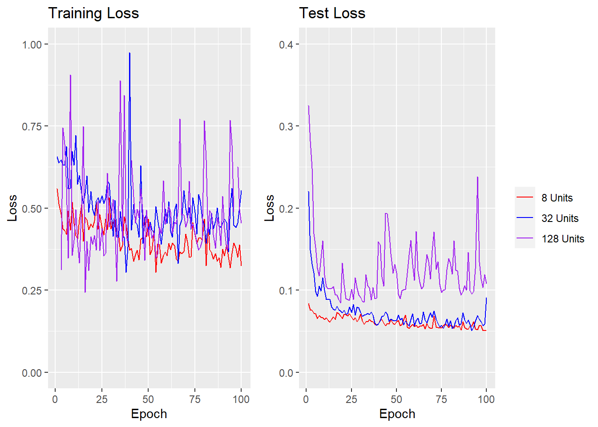
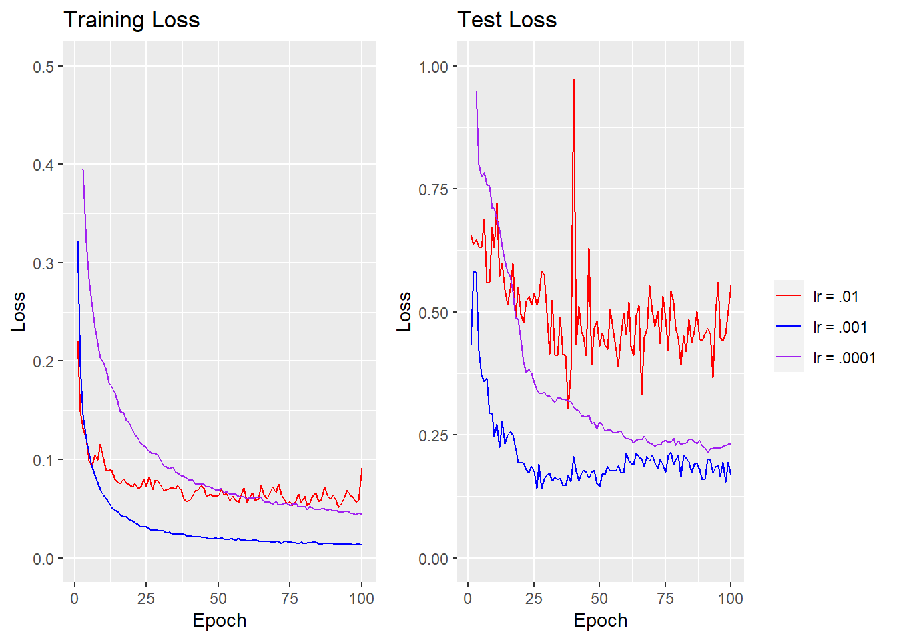
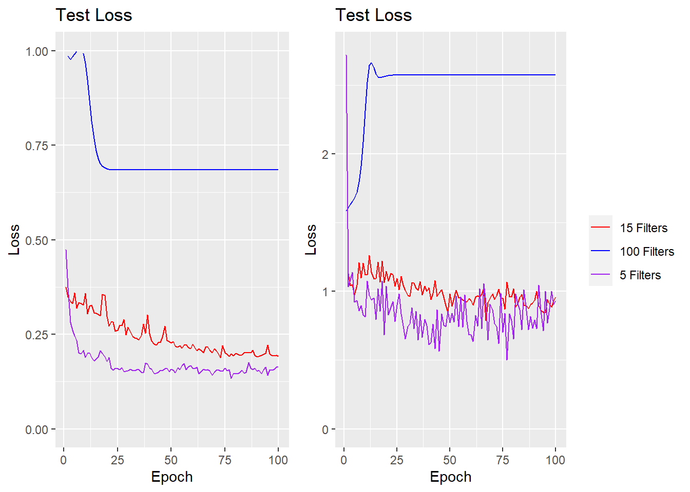
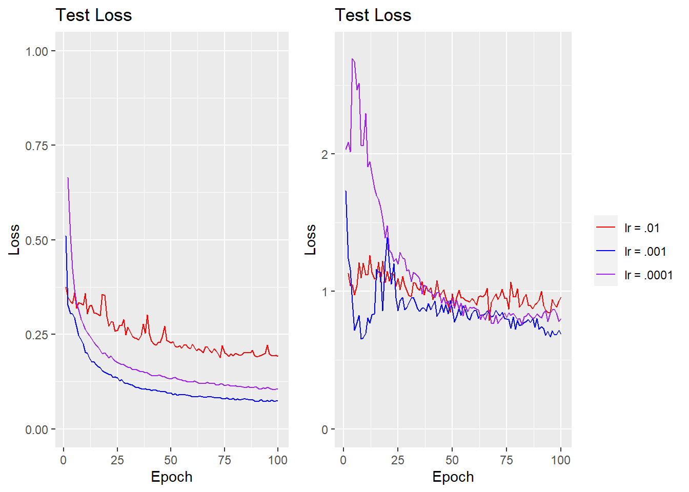

# Neural Network Methods for Electricity Demand Forecasting


## Introduction

Electricity demand estimation is a classic problem in machine learning with many papers addressing potential approaches. The classical approach in the literature for time series estimation are CART methods where suitably deep trees can model the discontinuities induced by sudden changes in weather. However, this is an open problem that permits a variety of solutions such as classical time series models like exponential smoothing with a variety of seasonal adjustments or Monte Carlo simulations of weather models as the basis for ensemble learning. Not wanting to commit myself to simulating weather dynamics, I'm going to investigate time series forecasting of the local power demand in New England using several common neural network models for forecasting and compare their performance. 

## Common Neural Network Designs for Forecasting

While there are an incredibly large class of models that can learn time dependencies (and innumerable additional variations on each broader class), there are only two main neural network architectures which are commonly recommended for general purpose time-series forecasting. 

The first are varieties of recurrent Neural Networks (RNNs) which learn how to create long term representations in memory of previous events. The most popular variants thereof are GRU networks and it's more complicated, but more popular, cousin, the rather confusingly named long short-term memory network or LSTM. LSTMs blocks consist of a single layer which is unwound to learn a series of inputs in the manner of all similar RNNs. However, in addition to learning a weight matrix that maps into its latent space, LSTMs also learn a series of mappings into and out of a memory unit. This memory unit can be of an arbitrary dimensionality and the LSTM learns dependencies upon the memory unit which allow the content of the input to alter the memory unit (ie remember a current feature or forget a feature it has remembered in the past) or allows the memory unit's content to alter current predictions. The LSTM learns these mappings in the usual RNN fashion of backpropogation through time though the number of number of parameters to learn is much higher per latent dimension due to the existence of the memory cell. 

These extra connections allows LSTMs to learn more complicated mappings back in time; functionally, LSTMs can be thought of as an extension on ResNet type architectures where LSTMs can learn more complicated types of skip connections. In fact, before transformers came into vogue for learning text embeddings, LSTMs were a popular option because of their ability to learn long term dependencies between different types of words in a sentence. It is this same property to learn longer term dependencies that we wish to exploit for short term power forecasting. 

The second primary method for learning time dependencies are convolution neural networks (CNNs). CNNs originated from adaptations of filtering techniques in image processing to neural networks; as a result, CNNs are primarily popular for their applications to image classification tasks. The traditional CNN design alternates filter layers where an arbitrary number of discrete filters from classical image processing (think sharpening or blurring filters) are convolved with different color layers of an image to produce feature mappings. These features are then fed into pooling layers which are essentially dimensionality reduction techniques that attempt to preserve spatial relationships between features. By chaining these layers together, one can build feature representations that are roughly translation invariant which is good for image classification where translation invariance is an important property. 

These same techniques can also by applied to applied to time series analysis by reducing the input dimension by one. Whereas in image classification 2d filters are applied across different color channels, in time series 1d filter are applied across different input features while pooling and fully connected layers are identical. While translation invariance and pooling layers are less important here, the local nature of filter layers allow the network to learn to identify types of events that have heterogenous future effects on the series and then propogate those forwards in the fully connected layers. 

## Problem Statement and Data

Short term electricity demand forecasting is an important task for managerial authorities who control the transmission of electricity and must respond to changing consumer demand and generation authorities who must make decision about whether it is profitable to turn plants on or off at certain times. Having robust models for all these parties allows operators to make more informed decisions about aligning supply with demand and thus creates more efficient market outcomes while avoiding problems like rolling blackouts or brownouts due to underprovision. 

We attempt to forecast per state demand in New England using previous values of demand in the relevant state and in neighboring states. Given that demand is highly dependent on temperature and thus time of year, the actual timestamps on the time series can also be used as features. In this case, we transform the month and hour components using sin-cosine transforms and use those as feature inputs. 

Our data is from the Energy Information Administration which, unsurprisingly, publishes energy demand information. Specifically, the EIA publishes per hour demand information broken down by specific state, grid authority, and region. We use the EIA API to pull a three year stretch of demand information over a group of New England states which we then plug into our neural network designs. I train on short term prediction accuracy, ie how good is the network at predicting the next hour of demand. This is a relatively approachable task that demands the network learn both trends over time, level changes over seasons, and short terms changes across days (ie over 24 or so samples). 

## LSTM Results

The main parameter to tune in LSTMs is the number of latent features. This allows the network to learn more complex feature representations across time. However, the number of parameters that arise from an increase in feature dimension is large meaning such an increase must be used sparingly if training time is an issue. Take this Keras printout from a relatively simple network of an LSTM layer followed by a fully connected layer which predicts one output:


```
## Model: "sequential"
## ________________________________________________________________________________
##  Layer (type)                       Output Shape                    Param #     
## ================================================================================
##  lstm (LSTM)                        (1, 20)                         2480        
##  dense_1 (Dense)                    (1, 20)                         420         
##  dense (Dense)                      (1, 1)                          21          
## ================================================================================
## Total params: 2,921
## Trainable params: 2,921
## Non-trainable params: 0
## ________________________________________________________________________________
```

The number of parameters are 5x greater for the LSTM layer despite having the exact same input and output dimension as the fully connected layer; this fact motivates designs that include fewer LSTM layers the number/dimensions of LSTM layers. In this instance, I will only be using 1 LSTM layer. Hierarchical LSTMs which use chained LSTMs to generate results are popular in some applications but are not strictly necessary to create sufficient model complexity due to the fact that LSTMs are recurrent and effectively generate depth by unwinding through time. The base model I use is an LSTM layer followed by a batch normalization and two fully connected layers with weight dropout as regularization. I first compare the efficacy of different LSTMs with for different hidden dimensions. Theoretically, more dimensions may allow the LSTM to model more complicated time trends: however, greater dimension also makes it substantially harder to train and prone to overfitting the test data more rapidly. 

We test the same data with LSTMs of dimension 8, 32, and 128, with mixed results. As can be seen below, the two smaller models perform comparably on the test data while the larger model starts to overfit around 25 epochs and is substantially more volatile. The most probable reason for this is a learning rate that is too large (.01 in this case). One of the nice results that comes out of the literature equating SGD updates to stochastic differential equation flows is that lower learning rates lead to greater approximations to the ideal SDE and thus lesser instability than what we see while more parameters pushes in the opposite direction (Jastrzębski et al 2018 is a great paper on this). I would say that it's highly probable the 128 unit model would perform at a lower learning rate, but I don't have the heart (or the time) to put my poor laptop through a grid search of said model, so I'm going to be looking at the 32 dimension model. Given that we only want to compare performance to CNNs and I'm definitely not going to be doing extensive hyperparameter tuning there (the Keras function has like 20 arguments), I'd say this permissible. 





That said, learning rate is probably going to be the other main parameter beside model size that determines how well the model fits, so we're going to check a few values for the 32 unit model to see how well the model generalizes. Given that the learning rate was probably too high for the 32 unit model judging by the slight instability in the training data, we try two smaller values.





It is clear that a learning rate of .001 wins out in this case and it seems that we hit it more or less on the head as both other learning rates exceed the test loss. Notably, for the blue .001 loss, the MSE has a valley at around 25 epochs and spikes upwards. We can say that playing around with higher epoch counts, early stopping is highly beneficial in this context as it has the capacity to overfit rather strongly otherwise. Note that the loss is MSE rather than MAE and the data is standardized which means that average error is around .3 standard deviations for the optimal model, which, all in all, isn't terrible and serves as a reasonable benchmark with which to compare CNN architectures. 

## CNN Results

Remember when I said that I wasn't going to do grid search on CNN parameters? I meant that. I could spend all my day (and computing power) sitting around playing with stride, activation functions, pooling layer width, kernel size, padding policy, etc. I'm not going to do that because it sounds boring. Also, that not quite the point here when I only want to get a rough comparison between LSTMs and CNNs.

The thing about CNNs is that they don't have complicated state transition maps which means that they don't require comparable parameters to a LSTM for the same depth. The first thing we test for CNNs is also model complexity and to make things fair we've decided to create architectures with comparable parameters counts. Note that counting parameters isn't a perfect solution here - models take different amounts of time to train and offer different amounts of flexibility per parameter. If increased parameter count concerns us because of increased training time, trying to measure said training time and equate it between models creates a very difficult situation where results are highly heterogenous between computer systems with different memory architectures despite identical algorithms (on top of the obvious semantic problems). If it concerns us because we want to equate model expressivity, the explicit bounds in the literature are both loose and very narrow while trying to measure effective degrees of freedom through some sort of matrix method (think smoothing splines) requires us to train models and identify global minima: which we can't do. So, we just take the naive approach and assume that equality of parameters roughly implies equality of other quantities of interest. 

The structure of our CNN model is relatively simple. Two convolution layers with kernels of size 19 and 11 are interspersed with 2 max pooling layers with kernels of size 3, which is followed by a fully connected layer that is linked to the output. The number of filters for each of the convolution layers is varied in order to achieve rough equality in the number of parameters between the comparable LSTM models and the CNNs. 

After specifying the model, we run into a big issue that isn't present in LSTMs: the decision about how many lags to include when training the CNN. Unlike LSTMs where past dependencies are only limited by how long your data goes back, CNNs require that all lags where one wishes to have dependencies be fed in at time of prediction. In some ways this is beneficial as it allows greater parralellism and thus greater batch sizes (whether this is desirable is debatable) that speed up training. The flip side is that the memory costs are much higher for CNNs, especially at higher batch sizes as the input requirements mean data duplication is almost always necessary. We had the frustrating experience of getting a memory overflow error a couple of time during training what is a relatively small dataset for this project (admittedly without a GPU or much RAM, but still). This consideration is probably going to be one that will dominate your thinking when choosing a specific model rather than efficiency concerns and the memory restrictions in our case means we can only model dependencies for a lag of up to 120 samples. 

A 120 sample restriction means it will be harder to model long term dependencies: let's see if that show up in the loss.    




The performance is not very good; especially for the larger model which finds itself a nice local minima in the training data (despite all my prodding to make it not do that) and overfits almost immediately on the test data. The medium size model performs a bit less well on the training data but it seems like it might generalize slightly better even if it's not overparametrized so I'll use that to test different learning rates on. 


```
## Warning: Removed 1 row containing missing values (`geom_line()`).
## Removed 1 row containing missing values (`geom_line()`).
```




The lower learning rates are comparable to each other while the higher one clearly struggles and bounces around in the training data. For the test data, they all suck. The optimal LSTM model had a test error (with early stopping) of around 1/2. The best CNN is 50% greater than that. Perhaps this is a problem that could be corrected with enough training but there's no a priori reason to believe an LSTM wouldn't also improve a commensurate amount. 

## Analysis

This analysis seems to indicate that LSTMs outperform CNNs on this specific dataset. This fact is not terribly surprising. We've already outlined how data limitations on CNNs make them less useful when modeling longer term dependencies. In addition, the kernel-pooling structure of typical CNNs is made to create translation invariance in image classification tasks which is not what one necessarily wants in a time-series regression context. 

If there's one good lesson here it's probably that CNNs really aren't as good as LSTMs for this specific sort of task but that one should really let one's problem domain guide model choice. Technically, CNNs and LSTMs are both models that can function in a time-series context. However, when one needs to model longer term dependencies (like fluctuations in power demand over the week when data is this granular), CNNs have specific constraints that make them difficult to use from an efficiency and memory perspective. However, I suspect that if one only needed to model short term dependencies, CNNs would be more efficient as they more explicitly model connections. 

And of course, this is only one experiment on the two most common sorts of models that are recommended for these sorts of tasks. One could also use an explicit time-series model (ARMA or the like), a random forest, smoothing splines, or even the combined CNN-LSTM models which are often held up as more efficient than either one. All that said, there are reasons why people don't readily apply certain types of models to data like this and if you choose to use a hyper-flexible model for time series, it should be because there are a multitude of factors that weigh in favor of its use. 
