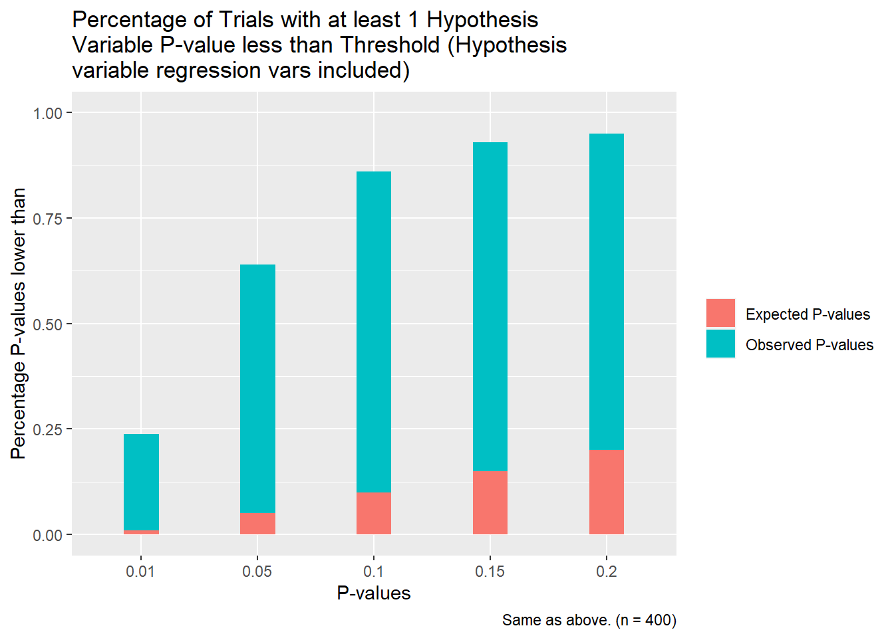

</script>

# (Almost) All regression confidence intervals are underestimated
## Introduction

So....frequentist statistics are a thing. And a very popular thing at that. The common language for most (if not all) of the social sciences is regression analysis; unfortunately, there is a lot of baggage there. The common pipeline for analysis goes as follows: determine some relationship to study, gather the IV and DV of relevance as well as a variety of control models, fit a tower of increasingly complicated models (more variables, fixed effects, interactions, etc) that control for some potential confounding factor, report some of these models, and then compare the coefficient values with your stated hypothesis and choose a confidence level at which you reject or accept your hypothesis. 
Almost all published research in fields like social psychology, economics, and the like are done using this model. The problem is that baked into the model are assumptions about the ways the models are estimated which don't accurately reflect the actual way in which research is conducted. The discrepancy between the two causes confidence intervals to be too narrow and an abundance of false hypotheses that should be rejected to instead be accepted. This article is going to discuss 1) the underlying assumptions in least squares regression and how they differ from actual research practice, 2) offer a statistical argument for why this discrepancy leads to errors, and 3) show simulations which demonstrate these errors in action. 

## Theory

### We run too many regressions
It is common practice in many papers to estimate a lot of regressions with a lot of different parameters and then to report some subset of these. Ideally, a researcher creates a theoretical model which creates some sort of dynamical equations which imply a relationship between two variables. They then want to test if this relationship is well founded by testing that relationship using regression analysis. Ideally, they collect data on these two variables as well as other covariates (which should also be in their model) and design a regression which represents the types of dynamics they should see in their model (ie log transforms for multiplicative relationships, dnd specifications or the like for confounders). Ideally, the model they specify is actually a quite good approximation of the real data generating process. In this ideal world, the researcher would actually be justified in taking their regression, looking at the confidence interval on the relevant IV and rejected or accepting the null hypothesis. The obvious problem is that neither we, nor any researcher I've ever heard of, actually live in this ideal world. 

Frequentist confidence intervals are statistical tests which are derived from the simple idea that if we take independent samples from the same population we can set a rejection threshold on the null hypothesis which ensures we reject the null hypothesis a set number of times in 100 if it is actually true. The crucial caveat in this line of reasoning is that the samples must be independent in order for the confidence intervals to be meaningful when compared across multiple models. 
Let us take an illustrative example. Imagine I have a cornucopia of potential models I can fit corresponding to a plethora of IVs and their transforms, splines, interactions, etc. Imagine then that I fit 10 models and am unable to reject the null hypothesis at a 5% level for all 10 of them. Fitting an 11th model where I'm able to reject the null hypothesis should probably not lead me to the conclusion that I've actually found the right model and I was right all along about the underlying inference I was trying to draw. 
A couple of things are worth pointing out here. For one, the inferential procedure where one fits a lot of models and looks at the confidence intervals to determine the worth of the next model violates the conditionality principle, so perhaps one ought to be skeptical of the last paragraph. That said, we're pretending we're all frequentists here, so who really cares? Secondly, the analysis in the last paragraph isn't remotely controversial; everyone knows this. Why the fuss then? To spoil a bit, I'm going to argue that it is almost statistically guaranteed we'll observe these erroneous rejections of the null hypothesis and that the procedures researchers use to select models do basically nothing to guard against them. 

### Preregistration is a good thing actually
Preregistration as a practice is something that has really caught on in a few fields - mostly the medical ones. The idea is that publishing a document with intending methods and data collection practices prior to actually doing the analysis forces researchers to cohere to practices that make their analyses valid. The downside is that it allows researchers less flexibility. The problems I outline wouldn't exist in a world where preregistration is the norm: researchers would outline a group of regressions based on their theoretical study and then do them on the data and report the results. Some say this might be overly restrictive. The argument against preregistration is that data is often unpredictable and if we actually knew what kind of relationships were in the data we wouldn't need to do the analysis. Preregistration prevents researchers from being flexible upon receiving the data and finding non obvious relationships. 

Of course, this counterargument assumes a best case sort of scenario. The other hand is that greater researcher freedom leads to a greater risk of manipulation (p-hacking seems to be the most common but outright fraud isn't unheard of). So, if we were people setting policy we would like to choose some level of prior restraint on researchers that minimizes the flexibility of bad actors to distort proper inferences. The problem is that there doesn't seem to be a good way to distinguish these two types of behaviors. Take a really canonical case of p-hacking. A researcher runs a naive regression and gets an adverse result. Not taking kindly to this, they then comb through the data to find nonconforming pieces of data they could justifiably remove, fit a bunch of models, and then report ones that agree with their hypothesis. No one disagrees this is bad. The problem is that it is quite hard to spot since there is a lot of subjectivity in data analysis. Want to exclude an observation? There are a lot of different outlier criteria. Want to justify a different model? There are a million and one potential effects that would justify the inclusion of a new term in the model. And so forth. 

Now, how would we characterize actual good faith inquiry into the dataset? The way I imagine it is that a good faith researcher goes in and combs through the data and does a lot of exploratory analysis and tries to look for relationships that they haven't conjectured. When/if they find one, they fit different models trying to tease out the nuances and then go back to their theoretical model and try to conjecture some new constraint or quirk that would generate the perceived variation and treat that as a new and improved model about how the world actually works. Note, the good researcher is essentially doing nothing different from the p-hacking researcher; they take the same steps in the same order. The intention is the only thing that's different. 

It is thus very hard to distinguish good from bad researchers just on the basis of their analysis. It may be that they make different decisions on the same data due to their mindset and we can differentiate them thusly. Approaches like this probably work in the most egregious cases but the aforementioned subjectivity in analysis makes this approach fraught. In fact, it's easy to imagine a world where good intentioned researchers simply are too convinced of their own theory and engage in what would be considered p-hacking behavior despite having a good mindset. 

The point is that from the perspective of an outsider, if we allow researchers to fit a variety of models, it is exceedingly difficult to distinguish good actors from bad actors. In fact, the only way to do it may be to attempt a blind replication; and even that is unlikely to be convincing for many. If it turns out that it is oftentimes the case that fitting a variety of models leads to bad results, this is a real problem. 

### A statistical argument

For all regression models in the limit, the inclusion of a variable which is independent from all others so far included in the model doesn't influence the coefficients. It is easy to see this by just looking as a matrix specification as follows:

$$\begin{equation}(X^TX)*\beta = X^Ty\end{equation}$$
For independent variables, the Gram matrix ($X^TX$) is diagonal and the addition of another variable on the bottom of $\beta$ does nothing to affect the rest of the system of equations. However, this is only true in the limit. In sample situations, it may the case that the projections of independent variables onto each other as in the gram matrix is nonzero (note, this is only a sample correlation function in the case of mean zero function to generate observations). In this case, the addition of a new variable may cause changes in the coefficients of the old ones. Take the very simple example of 2 IVs. 

$$\begin{bmatrix}P_{11} & P_{12}\\
P_{12} & P_{22}  
\end{bmatrix}
\begin{bmatrix} \beta_1\\\beta_2 \end{bmatrix}= X^Ty$$

Imagine now that $P_1$ is zero in the case with only 1 IV meaning that $y$ and $X_1$ are orthogonal. Now imagine that $P_{22}$ is non-zero and $corr(X_1,X_2)$ is nonzero (implying that $P_{12}$ is also nonzero). Then by plugging these numbers into the matrix above we can see that in order to make the first member of $X^Ty$ zero, $\beta_1$ must increase/decrease as much as $\beta_2$ decreases/increases. 

In this way, $\beta_1$ can be pushed up or down with sufficiently small samples just by including new variables even if it is asymptotically zero. The question then becomes how easy is it to find variables which are correlated (in a loose nonmathematical sense) both with $y$ and $X_1$ in the opposite direction that we want to push our coefficient? This turns out to be a very challenging question to answer with any sort of generality. The nice thing is that if we simplify a bit the question of whether $X_1$ is correlated with $X_2$ and whether $X_1$ is correlated with $y$ are the same question of establishing the distribution of the sample correlation between independent variables.

Let's take the example of two groups of iid standard normal distributions $X_n$ and $Y_n$. When I say 'correlated' in the last few paragraphs, what I actually mean is that the sequences of the two variables have a nonzero dot product when treated as a vector (as in the right side of the regression equation). So, what we want to study is first $X_nY_n$ then $\sum_{n}X_nY_n$. In the case of the normal distribution, the distribution function takes the form of a kind of multiplicative convolution:
$p(x)=\int_{-\infty}^{\infty}f(\frac{x}{y})g(y)dy$ where f and g are the two densities. Just like the case of convolutions, there is no general closed form solution to these sorts of problems (and this is even more difficult as we don't have Fourier transforms to help us simplify the problems). It turns out that you can write $XY$ as $\frac{1}{4}(X+Y)^2-\frac{1}{4}(X-Y)^2$ which is the sum of two chi-squared variables (by the fact that independent normals are closed under summation). This fact implies we can write the characteristic function as the product of the characteristic function of the two chi-squared variables. Doing this gives us a complicated expression with the product of exponentials and some sqrt of t functions in the denominator. Perhaps there's some hope using some sort of contour integration approach to take the fourier transform and recover some useful information about the density function(though the fact that the exponentials are of opposite sign makes this more difficult). I haven't really tried mostly because if I succeeded it wouldn't provide any sort of hope in the general case. 

Fortunately, we can take a step back and employ some simpler math to get some heuristics to guide further inquiry. Notice that 1) $X_1Y_1,X_2Y_2,...,X_nY_n$ are all jointly independent by definition and 2) we're actually interested in the sum of these since it's the dot product which shows up in regression formula. Imagine now that we restrict our interest to variables whose generating function has finite moments. The Central Limit theorem is then an obvious tool here that allows us to examine the limit distribution. For independent $Y$ and $X$, $E[XY] = E[X]E[Y]$ so we can use information about the individual distributions to determine the mean. I assume wlog that one of the distributions is mean 0. Thus, $\frac{\sum_NX_nY_n}{\sqrt{N}\sigma(XY)} \rightarrow N(0,1)$. Note that the $\sqrt{N}$ factor is in the denominator because the sum of the product over $N$ is a sum and not a sample mean. The implication is that $\frac{\sum_NX_nY_n}{\sigma(XY)} \rightarrow N(0,N)$, or, in english, the variance approaches infinity at a linear rate as the sample size increases. This is good as we want the eigenvalues of the gram matrix to become arbitrarily large for uncorrelated samples as $N$ increases as this allows the betas in the regression equation to become arbitrarily small. Of course, the probability of the sum being within any compact set never goes to zero, but this isn't a problem as it becomes arbitrarily small (literally the opposite of bounded in probability) which is good enough for our purposes. 

The fact that we have the correct asymptotic behavior is comforting but it only tells us some of what we need to know in the finite sample realm. Here, once again, we can only speak in broad generalities since rates of convergence to the normal approximation depend on the distribution. Roughly speaking, the smaller the larger the moments >2, the slower the convergence. This can be seen by looking at the Taylor expansion in the moment generating function proof for the CLT. Given that we allow all distributions with finite moments, there isn't a good procedure to create upper bounds on the rate of convergence. Fortunately, this is the exact same problem that researchers run into when estimating confidence intervals in normal regressions and they come up with variable transformations and the like that make them comfortable the approximation is sufficient so I don't know why I shouldn't also be. As long as we accept this, it also shouldn't provide us much discomfort that we had to restrict ourselves to variables who are generated with finite moments as we believe in all practical cases we believe we can transform unbounded variables to bounded ones.

All this is to say that the normal approximation to the limit distribution is probably a good one. From a theoretical perspective this is nice for me, but I now argue that it should make us less confident in the regression analyses that we read. The basic argument is as follows: given the linear increase in the variance from the normal approximation, it takes a lot more samples if we want to make it substantially harder to find a variable transformation which leads to a significant coefficient on the operative variable. Conversely, the number of possible regressions grows exponentially. The number of regression equations possible with n IVs is $2^{n-1}$. We get that again if we include all squared terms. The number of possible interactions is $2^{n^2-n}$. The point is the number of possible regression equations grows quite fast if we allow commonly used transforms. The way to think about this conceptually is that we want to find transformations of the generated samples which point in certain directions such that the resulting regression equation yields a significant value for the IV contained in the hypothesis (it's actually an affine subspace we're searching for rather than a direction, but same difference). If the allowable transformations sufficiently mix the space, then the exponential growth of allowable regressions functions means that the probability of finding one of those directions becomes quite high. 
There is more math that could be gone into here, but approximation and ergodic theories are their own worlds and I haven't been particularly brief as it stands. That said, we should expect intuitively that functions like power functions provide the proper mixing properties given the completeness of the Taylor series for approximating analytic functions. To test this, I run a few simulations. 

## Practically Speaking

### Simulations
I would love to run simulations with a lot of samples and variables and so forth, but my laptops bones are old and weary, and thus won't allow me to. So, I've settle for something a bit more modest. The idea behind the simulations is simple: I generate random normal variables equal to the number of IVs plus one (corresponding to the DV). The first IV is the one whose coefficient we'd like to test if we can make it significant and will be called the 'hypothesis variable.' All the other are 'control variables.' The mean and standard deviation of each variable are controlled using hyperparameters and are thus standard normal. I run simulations using relatively conservative constraints. For the first experiment, I take all control variables, all interactions between, and all power of 2, and then run a regression over all subsets of fixed sizes that don't include any of the basis function transformations of the hypothesis variables (in this case, all subsets of four linear terms, two interaction terms, and three polynomial terms). I then repeat this over a large number of samples and report the measured quantiles for the best case p-values on the hypothesis variable. 

To interpret the graph above: the red is what one would expect if the confidence interval estimates were actually proper (ie we would expect to see a p-value less than .2 twenty percent of the time and so forth). The blue values is what we actually observe. Just looking at it roughly, it seems the p-values which are calculated the normal way are around 30% more confident than they really ought to be. This is a pretty big disparity; that said, the fact that the disparity is substantially lower at the low p-values is somewhat heartening. This simualtion is only a very small fraction of the broad expanse of models we could reasonably expect a researcher in this situation to estimate though. So, let's broaden things up a bit. The next simulation is the same as the last except that transformations of the hypothesis variable are allowed and we report a positive result if any of these transformations yields a positive p-value. The results are as follows:

This is much much worse. For almost all samples (which should be completely independent) we can find a transformation that gives the hypothesis variable a p-value of .2 or above. For about a quarter of samples we can find one that is significant at the 1% level. Clearly the conventional p-values are way off here. And we this is still a severely restricted set of transformations that we're working with. Not good. 

### What does it all mean?
It is worth noting that the problem of it being too easy to fit models to data is in no way exclusive to academic fields that gravitate towards regression analysis or even fields where statistics are all that prominent. Particle physics has a similar sort of problem. After the failure of the LHC to find supersymmetric particles, a common accusation lobbed against string theorists is that whenever there is an adverse experimental finding against their theory they always adjust the theory by adding a new particle or whatever so that it against conforms with experimental results without grappling with the failure to make accurate predictions in the first place. The string theorists generally respond that every theoretical framework has falsifiable versions of it and that the underlying unification of gravity and quantum mechanics is quite valuable^[Entertainingly, physics also has a statistical problem where they set confidence intervals for their measurements of fundamental constants and pretty regularly get updated estimates that are outside those intervals from more precise experiments, but that's neither here nor there.]. One can come down on either side of this debate but the point is that these sorts of issues aren't restricted to the softer sciences.

The larger point is that there are very difficult systemic issues in how we do research that make it hard to get reliable results. I've talked a lot about p-hacking vs honest inquiry in the previous sections and that's an important framing device for why we care that confidence intervals are probably too wide. That said, I think these issues would still persist even if we were totally confident that all researcher were totally honest and none were p-hacking. Researchers are simply given too much flexibility to create models. 
If we frame the problem like this, the only solution is to restrict the flexibility researchers have. Broadly, I think I'm in favor of this; however, there are good and bad ways to accomplish that goal. I've already alluded to pre-registration being a good paradigm to use. In a purely Platonic sense, the restrictions to researchers there are rather severe in the sense that researchers can't deviate much from the plan^[Or they can't deviate much in the platonic ideal case of pre-registration. Practical implementations often have researchers giving much less information than might be desired.]. The key side benefit of this is that it forces them to think more carefully about the theoretical underpinnings of the types of models they're building and why they are making the assumptions they do. This is a really really good thing as in-depth model analysis is something that just doesn't really happen in the empirical literature in fields like economics. 
Another good path would be to encourage researchers to make it easy to replicate their work. As it stands, in many papers the control variable matrices often aren't even fully specified as to what variables they contain. It's hard to check if these controls are reasonable as very few authors give the data and scripts necessary to replicate their work. Such access could serve as a sort of check on bad research that abuses the data. 
Of course, what this really boils down to is just the idea that people should be better at research. People should use better methods, should build better models, etc. And in some respect that seems like wildly wishful thinking in a sense that I agree with. The problem is that the world we live in is one where there's a lot of bad research and fewer institutions to correct that than there should be. So, if the world can't be perfect, at least we can try some things that might make it a little better. 
