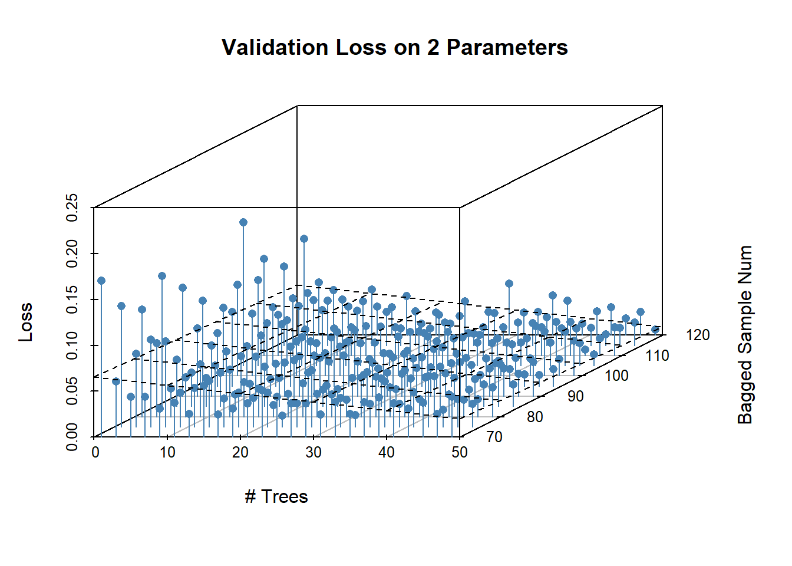

# Gaussian Process MBO for Random Forests

## Overview of Gaussian Processes

Hyperparameter tuning is a tricky subject. Oftentimes, one simply conjures up a reasonable value from the some article about whatever architecture that one read sometime or another and plays with that until it works. This type of approach is reasonable insofar as hyperparameter tuning is very, very hard and there are a lot of answers that may look, a priori, equally reasonable while providing wildly different results in practice. Take neural networks for example. One could take a given value for the learning rate. Except that there's a lot of literature that shows learning rate and batch size interact to shape the loss the function and one can't set them alone. Or say you want to vary the weights of different hidden layers. Except that also affects your weight initialization strategy. And it goes on. 

Hyperparameter optimization is often very difficult and consensus on good decisions for any one dataset (think MNIST) is frequently the product of a multitude of separate experiments. The go-to approach when one has a relatively flat prior about the efficacy of a set of parameters within a compact set is just grid search. This does get the job done but is computationally expensive and ruinously vulnerable to the curse of dimensionality when dealing with complex or highly tunable models. 

All these facts make efficient automated approaches to hyperparameter tuning highly desirable. The issue here is that it is often impossible (or unclear how) to differentiate model parameters with respect to the data. Either the models employ functions which themselves are discontinuous or nondifferentiable or the parameter values are integers which means there is no reasonable interpretation of the change in objective in a neighborhood around the parameter. The lack of a derivative means that most traditional continuous optimization methods become either useless or inefficient (integer programming for example). There are a few possible solutions to this problem. One is to transform the model so that it may be differentiated. VAEs use a parametric assumption on latent space to allow differentiation. Random hinge forests are a differentiable version of the random forests I will talk about later. 

Obviously, differentiability is not always possible (but always imposes significant additional complexity on the model). Therefore, a more flexible parameter search option is desirable. One way to do this is to model the hyperparameters and the resulting loss as a gaussian process. Gaussian processes are any collection of random variables where any finite subset thereof are distributed jointly gaussian with an arbitrarily flexible covariance matrix. In this instance, the random variables are the objective values of the function. Gaussian processes generally assume that all variables have an unconditional mean of zero; however, they may also have a non-zero conditional mean depending on the realizations of other random variables and the relevant covariances. 

Estimation procedures for gaussian processes exploit this fact to build flexible models of the objective function. The main procedure is as follows: one obtains a requisite number of samples of one's objective function with differing hyperparameter values. One then chooses a stylized covariance matrix in the form of a kernel function. Technically speaking, nothing about the definition of gaussian processes above implies they are continuous (ie they might have negative or zero covariance locally). However, continuity is a property we expect from basically all our objective functions. To ensure the estimate of the objective function satisfies this continuity requirement, covariances are assumed to a kernel function of the metric of the distance between the two functions. This assumption creates a parametric framework for the covariance which otherwise could not be estimated, imposes continuity on the function, and still allows the process to be a universal approximator given sufficient sampling. 

With the covariance assumption in place, estimating the value of a point in the hyperparameter domain is as simple as calculating the conditional mean of a jointly gaussian variable. Of course this is just an estimate of the actual value of the objective function and may bear only a small resemblance to reality. The procedure to find the actual minima in the hyperparameter surface is an iterative one. Given the sampled points, some nonlinear optimization is used to find an estimate of the minima of the initial objective function; BSGF is the most common method but others are obviously available. The estimated minima is then sampled and included with the other points to form the basis for a new objective. This process is then repeated until some stopping rule is reached. 

The primary benefit here is that the number of models trained is minimized. The tradeoff is that one must pay for the cost of whatever nonlinear optimization function one is using. Whether that is beneficial largely depends on the hyperparameter space and the model among other things. 

## Application to Random Forests

I'm going to test this on random forests. Random forests are a bagging method that allows multiple (relatively) uncorrelated trees to vote on the class of an observation. In short, multiple decision trees are fitted to individual bootstrap estimates of the sample data. When splitting each tree at each level, features are again bootstrapped to reduce tree correlation. An observation is then given a predicted class value based on the plurality of trees. 

Random forests are beneficial in that there are a lot of potential hyperparameters to tune. One can adjust the number of trees, maximum length of trees, the maximum number of terminal nodes, the bagging parameters for the individual trees, the bagging parameters for the nodes, and so forth. The hyperparameter space can be high dimensional if one chooses to make it so which makes it ideal for testing out gaussian process regression. Random forests are also traditionally very flexible which make overfitting an issue. So, instead of tuning the training error as the objective function, I use the test error in n-fold cross validation as the objective function. 

## Data

I use a dataset of wine vintages from the UC Irvine machine learning repository. It has approximately 180 wines from 3 different italian wineries. Each of them were given chemical composition tests that give values for a variety of quantities like alcohol percent, hue, or the amount of phenols. There are 13 variables in total and which are split roughly equally between three possible classes.


```r
plot_data = melt(select(wine_data, !c(proline, origin)), values.name = "Value") %>%
  mutate(value = log(value))
```

```
## No id variables; using all as measure variables
```

```r
ggplot(data = plot_data, aes(variable, value)) +
  geom_boxplot() +
  theme(axis.text.x = element_text(angle = 90, vjust = 0.5, hjust=1)) +
  labs(title = "Variable Distributions", x = "Predictive Variables",
       y = "log(Value)")
```


I take the log for this graph to make each level visible on the same graph but don't do so for the data itself. Anyways, most variables have roughly the same variance, lack distinguishable tails, and have roughly similar levels. It's nice data where I don't have to do much (databases are so nice). 

The amount of data is relatively small but that's good for me because it is still able to be used while not requiring me to run grid search on a massive dataset. The implications thereof will be discussed later. 

## Results

### Grid Search
I use the RandomForest package from R to do this analysis. It has a wide variety of parameters over which I can optimize and I select a few. The first is the number of trees that the random forest produces. This parameter controls the flexibility of the model; the more trees there are and the more bagged samples the trees are being trained on, the more specific models will be able to specialize on certain parts of the data. The next variable is the number of bagged variables that are sampled at each split; a lower number increases tree decorrelation but raises the number of trees required to represent the sample because each tree is less powerful. There is also a binary variable that controls if sampling with replacement is done that I allow to be toggled along with a variable that selects the sample size for each tree. And finally, the node size parameter controls how many samples can be contained within a node without it splitting. Together, these form the basis of a parameter set in the ParamHelpers pack that we can plug into the mlrMBO package to optimize it. 

The main metric I'm interested in is how many iterations it takes the gaussian process to obtain a solution with a comparable objective value as the one that the grid search obtains. Given that I'm concerned about speed, I could hypothetically time each method and report those speeds. However, that seems besides the point to me. As mentioned, the main factor affecting speed is the time it takes to train the model and the convergence rate of the optimization algorithm. If I found that grid search was faster, I could replace this model with a similar one that takes 10x longer to train and get the opposite result. The convergence speed of the gaussian process is something that is less subject to changes in the previous two variables and thus more interesting an object of study.  

Anyways, cross validation libraries in R tend to be a bit library dependent and it's pretty easy to implement, so I write my own k-fold cross validation script. Instead of explicitly defining parameter values, 


```r
forest_cv = function(n_folds,predictors, outcomes, forest_vars){
  loss_per_fold = c()
  
  data_left = nrow(predictors)
  per_fold = data_left/n_folds
  empirical_losses = c()
  
  shuffle = sample(nrow(predictors))
  pred = predictors[shuffle,]
  out = outcomes[shuffle]
  fold_train_in = data.frame()
  fold_train_out = data.frame()
  fold_test_in = data.frame()
  fold_test_out = data.frame()
  
  for(i in 1:n_folds){
    if(data_left < per_fold){
      fold_train_in = pred[-(((i-1)*ceiling(per_fold)):nrow(pred)),]
      fold_train_out = out[-(((i-1)*ceiling(per_fold)):nrow(pred))]
      fold_test_in = pred[((i-1)*ceiling(per_fold)):nrow(pred),]
      fold_test_out = out[((i-1)*ceiling(per_fold)):nrow(pred)]
    }else{
      fold_train_in = pred[-(((i-1)*ceiling(per_fold)):(i*ceiling(per_fold))),]
      fold_train_out = out[-(((i-1)*ceiling(per_fold)):(i*ceiling(per_fold)))]
      fold_test_in = pred[((i-1)*ceiling(per_fold)):(i*ceiling(per_fold)),]
      fold_test_out = out[((i-1)*ceiling(per_fold)):(i*ceiling(per_fold))]
      data_left = data_left - ceiling(per_fold)
    }
    
    forest = do.call(randomForest, 
                    c(list(x = fold_train_in, y = fold_train_out), as.list(forest_vars)))
    
    loss = data.frame(preds = predict(forest, fold_test_in), vals = fold_test_out)
    loss = loss %>%
      transmute(loss_vals = case_when(preds == as.numeric(vals) ~ 0, TRUE ~ 1)) %>%
      dplyr::pull(loss_vals)
    loss_per_fold = c(loss_per_fold, mean(loss))
  }
  return(loss_per_fold)
}
```


The forest_cv function accepts a list or vector of named parameters to randomForest as input. To generate these, I create lists of each acceptable param value and just use what is effectively a cross join to create all possible combos (filter can be used afterwards if you have conditional dependencies between variables, even though I don't).


```r
grid_param = list(ntree = seq(from = 1, to = 50, by = 2), 
                  mtry = seq(from = 1, to = 12, by = 1),
                  nodesize = seq(from = 1, to = 10, by = 1),
                  sampsize = seq(from = 80, to = 180, by = 5),
                  replace = c(TRUE, FALSE)) %>%
  expand.grid()
```

Plugging these parameter values into the forest_cv function gives me a validation set loss for each set of parameters. Predictably, this takes a long while to run. Notice that, because training trees is stochastic, loss values can vary across each run.

The large number of parameters means that it's actually relatively difficult to search for a single configuration of parameters that is superior to any other. In fact, there were 9 of the parameter configurations which achieve zero error even on the validation set. 

```r
filter(grid_loss, grid_loss == 0) %>%
  select(!c(test_list, X))
```

```
##   grid_loss ntree mtry nodesize sampsize replace
## 1         0    43    1        8       95    TRUE
## 2         0     9    5        4       70   FALSE
## 3         0    17    1        1       95   FALSE
## 4         0    25    2        1      105   FALSE
## 5         0     9    2        4      110   FALSE
## 6         0    13    1        7      115   FALSE
## 7         0    25    2        6      120   FALSE
## 8         0    25    3       10      120   FALSE
```

Obviously, these values are suggestive in that certain parameters seem to bunch around certain values. Ntree looks like it might be optimally 25, mtry 3, samplesize is mostly in the higher part of the possible range, replacement increases the variance too much, etc. However, any of those conclusions require a degree more of interpretation than would perhaps be desirable for a process which is supposed to be more automatic than other hyperparameter selection methods. The presence of a stochastic fitting method and a lot of grid search points - 66k to be exact - means there's a very real threat that the grid search overfits to the validation set. We'll return to the general question of test error later on, but one way to evaluate this is to look at broader plots of error across the range different variables like the one below:


```r
scatter_data = filter(grid_loss, mtry == 3, 
               nodesize == 10, replace == FALSE)[,c("ntree", "sampsize", "grid_loss")]
sc = scatterplot3d(scatter_data, pch = 16, color = "steelblue", type = "h",
              main = "Validation Loss on 2 Parameters",
              xlab = "# Trees",
              ylab = "Bagged Sample Num",
              zlab = "Loss")

my.lm <- lm(scatter_data$grid_loss ~ scatter_data$ntree + scatter_data$sampsize)
sc$plane3d(my.lm)
```


Looking at the points visually (and at the regression plane) seem to confirm the intuition the greater number of trees and larger samples are good. However, it is easy to look at any region in the plot and find points which have low error. Of course, this doesn't mean grid search has hopelessly overfit per se. Just that one can find evidence that many configurations of hyperparameters are efficient if one wants to and that a more judicious procedure is necessary for selecting the final grid point. 


### Gaussian Process Search

I use the mlrMBO package for Gaussian Process search. This package wraps the ParamHelper, smoof, and DiceKriging packages which implement most of the necessary logic. The MBO function accepts 3 types of objects: a learner which determines the next step to take in the parameter space, a design matrix which gives the priors over the space, and a control object which determines termination and local search depth. In my case, I sample 20 points uniformly from the parameter space, and allow a 10 iteration focus search to identify a locally optimal point. I allow the process to run for four iterations. 


```r
forest_obj = smoof::makeSingleObjectiveFunction(name = "Gaussian Process Forest", 
       fn = forest_wrapper,
       has.simple.signature = FALSE, 
       par.set = makeParamSet(
         makeIntegerParam(id = "ntree", lower = 1, upper = 50),
         makeIntegerParam(id = "mtry", lower = 1, upper = 12),
         makeIntegerParam(id = "nodesize", lower = 1, upper = 10),
         makeIntegerParam(id = "sampsize", lower = 70, upper = 120))
       )

ctrl = makeMBOControl(propose.points = 1) %>%
  setMBOControlTermination(iters = 5) %>%
  setMBOControlInfill(crit = crit.ei,
                      opt.focussearch.points = 10)

des = generateDesign(n = 20, par.set = getParamSet(forest_obj), fun = lhs::randomLHS)

lrn = makeLearner(cl = "regr.km",
                  predict.type = "se",
                  covtype = "gauss")


mbo(fun = forest_obj,
    design = des, 
    control = ctrl,
    learner = lrn,
    show.info = TRUE)
```

This code block is going to output an absolutely huge amount of data about the optimization path which is frankly rather hard to read and completely irrelevant. Instead, I'm going to copy over literally the only line of the output which actually matters:


```
## Recommended parameters:
## ntree=31; mtry=3; nodesize=6; sampsize=99
## Objective: y = 0.018
```
This result seems very reasonable based on our previous investigation of what optimal parameters might be. Perhaps the number of trees is too large or sample size is too small, but the values are close. The validation loss ("Objective" in the output) is higher than comparable objectives in the previous section, but this could be expected given the previous discussion on overfitting. Notice that there isn't really that much interpretation for me to be doing here: I run the algorithm and the fact that I'm doing many less function evaluations means that there's no huge space of results I need to consider. I just pick the one with the lowest loss. 

## Discussion

The most notable thing here is that I have gotten a similar result to grid search with the gaussian process only by doing 4 iterations that evaluate a maximum of 10 points each. This is a miniscule fraction of the 66k evaluations that I did in the grid search. I know I said I wouldn't talk about time, but it is worth mentioning that the grid search took 45ish minutes while the gaussian process took easily less than a minute. The easy conclusion is that gaussian processes are a lot more efficient at finding approximate solutions that are near the minima but might not be the best compared to an exhaustive search. 

However, this analysis neglects the overfitting concerns that imply that the lower bounds on the validation error for exhaustive type searchs are misrepresentative of the true test error. I've held out a test set of 20 observations; let's take a look at the test errors there compared to the test errors on the recommended model from gaussian process regression. 


```r
grid_loss %>%
  filter(grid_loss == 0) %>%
  rename(`Test_Loss` = test_list) %>%
  select(!c(grid_loss, replace, X))
```

```
##   ntree mtry nodesize sampsize Test_Loss
## 1    43    1        8       95      0.00
## 2     9    5        4       70      0.05
## 3    17    1        1       95      0.05
## 4    25    2        1      105      0.00
## 5     9    2        4      110      0.00
## 6    13    1        7      115      0.00
## 7    25    2        6      120      0.00
## 8    25    3       10      120      0.00
```

Probably unsurprisingly, these models do a good job of describing the data and most have zero test loss also. However, a couple of them do manage to misclassify an observation or two. When we run the model that the gaussian process selects we get a test error of zero which is exactly in line with what we get from the best models in grid search. There are two points to be made here. First of all, it's hard to say exactly how trustworthy this result is because of the sample size. 20 observations isn't very much and the power of this test isn't very high so it could be that the gaussian search model is overrated. That said, the structure of the gaussian process which encourages fewer evaluations could also be viewed as regularizing which would have the tendency to increase its performance on test sets. Obviously it has less information about the performance on the training set than the grid search but that doesn't necessarily imply lesser performance on the observations we care about. 

All this gives a pretty good account of gaussian processes as a method; I'd like to just point out a couple more things that make them desirable. For one, they adapt better to increasing dimensionality than grid search does. The amount of evaluations for grid search is exponential in the dimension of the data so it's not like the competition is hard here. It's very hard to put bounds on the performance of gaussian processes because it mostly depends on how well the funtion concords with the kernel but empirically convergence is relatively fast and the local search algorithms they use have polynomial bounds for sufficiently regular functions (like most loss functions). They also are able to get a better local estimate of the optimal hyperparamter arrangement than grid search. Grid search inevitably allows gaps between points in order to make the number of evaluations tractable. These gaps can become rather large (especially when the dimension is high) and naive grid search methods have no way to interpolate between them. Gaussian processes aren't restricted this way and can narrow in on a very specific local estimate at any value allowing them to get a better outcome in the limit than grid search. 

I'm not going to pretend like there are all positives. Gaussian process search is rather finicky and there aren't many packages that do it in R. The ones that do tend to all have their own specific type of objects that they like and accept and don't play nice with others. It can get complicated and is almost definitely overkill for small projects. However, when hyperparameter searches are important and function evaluations are expensive, this is a great option that minimizes the search time and is highly tunable for your specific purpose. 
